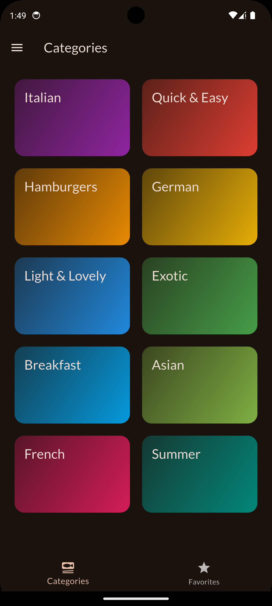
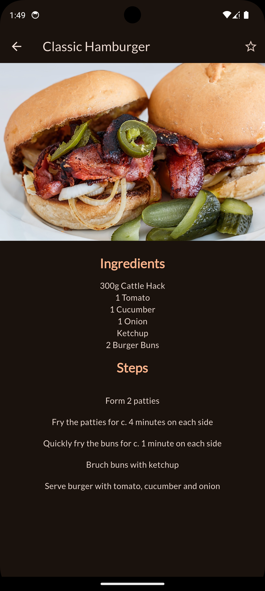
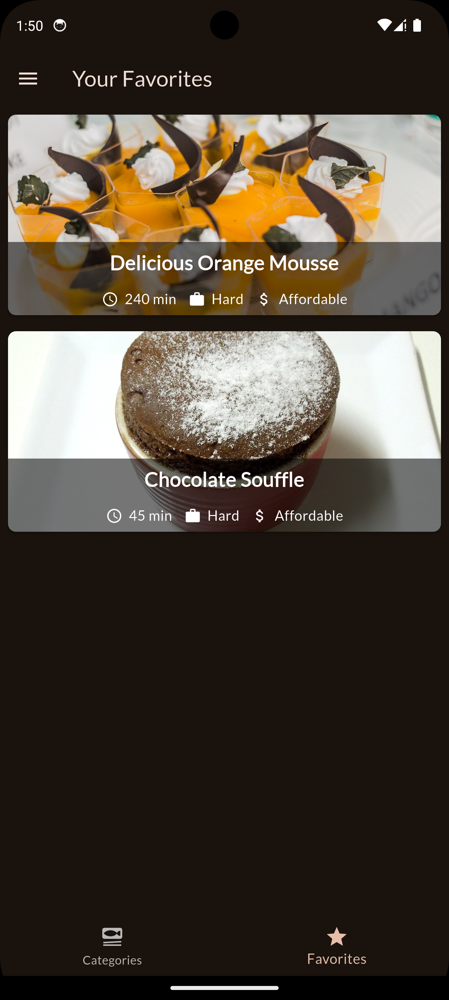
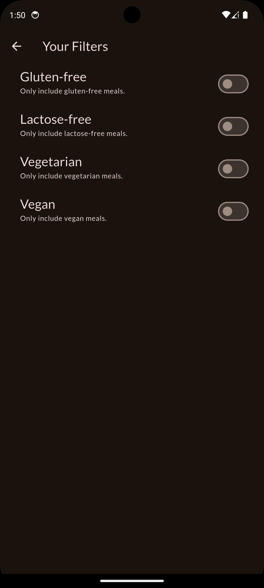

# Meals App

Meals App is a Flutter project that provides a collection of meal recipes. Users can browse through various categories, view meal details, and mark their favorite meals.

## Features

- Browse meals by categories
- View detailed information about each meal, including ingredients and steps
- Mark meals as favorites
- Responsive design for different screen sizes

## Screenshots

<div style="display:flex; gap:24px;">
  <span>
    
    
    
  </span>

  <span>  
      
    
  </span>
</div>


## Installation

1. Clone the repository:
   ```sh
   git clone https://github.com/yourusername/meals_app.git
   ```
2. Navigate to the project directory:
   ```sh
   cd meals_app
   ```
3. Install dependencies:
   ```sh
   flutter pub get
   ```
4. Run the app:
   ```sh
   flutter run
   ```

## Dependencies

- [flutter](https://pub.dev/packages/flutter)
- [google_fonts](https://pub.dev/packages/google_fonts)
- [flutter_riverpod](https://pub.dev/packages/flutter_riverpod)
- [transparent_image](https://pub.dev/packages/transparent_image)

## Contributing

Contributions are welcome! Please open an issue or submit a pull request for any improvements or bug fixes.
